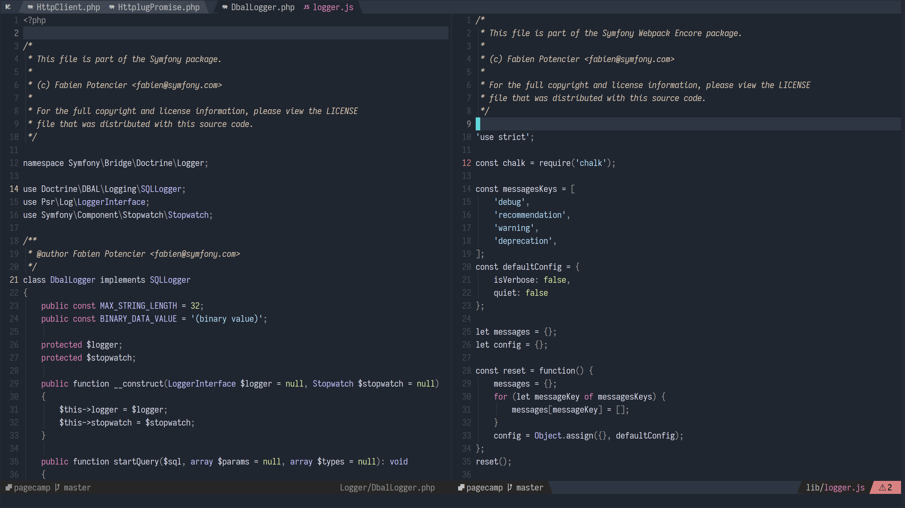

# outrun-vim (v0.1)

A dark theme, with some retrowave accent.

Warning: Even if use this theme daily, this is still a work in progress in a very early stage. 

My main editor is Neovim with treesitter activated, and I mostly use it for web development. Consequently, a lot of highlights, filetypes or plugins are not supported yet.

## Screenshot

## Installing outrun-vim

Put outrun.vim file on the "colors" directory, or use a package manager. Ex, with Plug:

    Plug 'u03c1/outrun-vim'

## Enabling outrun-vim

In your init file:

    set termguicolors
    colorscheme outrun

## Hacking Outrun-vim

Outrun-vim comes with the very template used to generate it: colors/outrun-vim.erb. The template, based on vim-rnb, is well maintained and documented.

If you feel like making a pull request, make sure you commit both the modified template and the modified colorscheme.

## Credits
* Theme created using [vim-rnb](https://github.com/romainl/vim-rnb)

